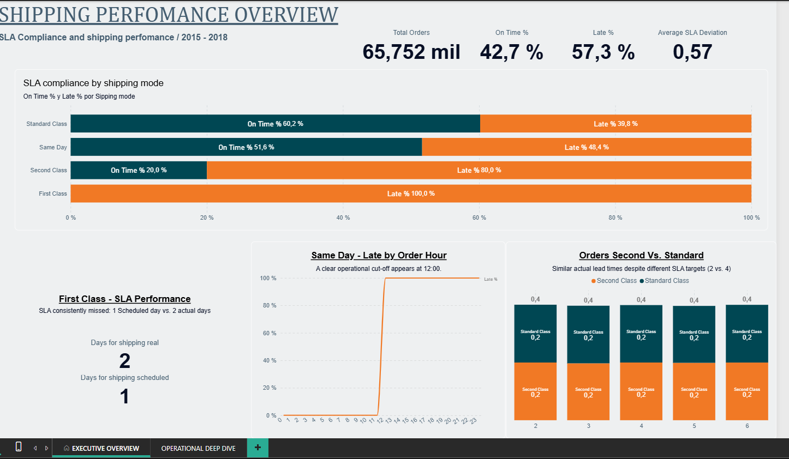
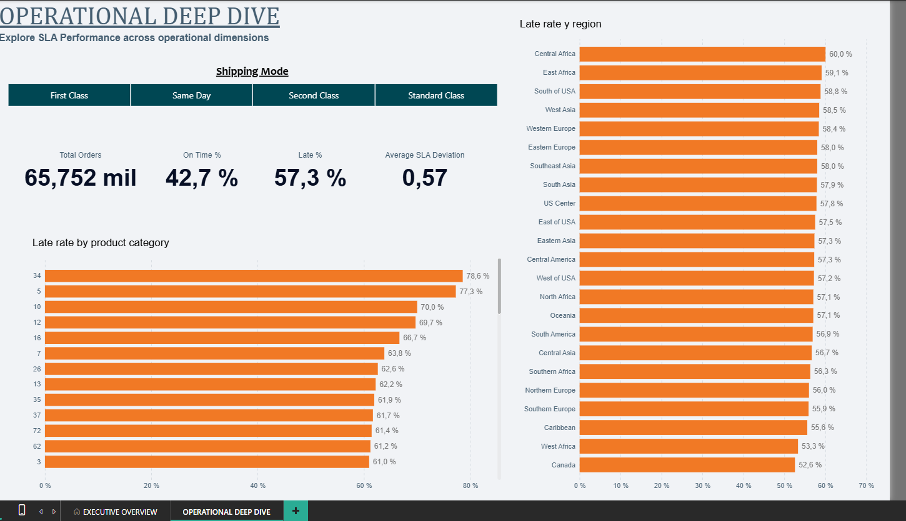

# Shipping Performance & SLA Analysis

Supply chain analysis focused on identifying patterns behind shipping delays and evaluating whether defined service levels (SLAs) are aligned with observed operational performance.

The project uses **Power Query** for data preparation and exploratory analysis and **Power BI / DAX** for data modeling, KPI calculation and interactive visualization.

## Project Files

- [View detailed methodology](documentation/methodology.md)
- [Download Power BI report](dashboard/Shipping_Performance_Analysis.pbix)
- [Original dataset on Kaggle](https://www.kaggle.com/datasets/shashwatwork/dataco-smart-supply-chain-for-big-data-analysis)

## Dashboard

### Executive Overview

### Operational Deep Dive

## Business Question

**Where is SLA non-compliance concentrated, and what observable factors are associated with shipping delays?**

The analysis started by comparing scheduled and actual shipping times across the four shipping modes available in the dataset:

* Same Day
* First Class
* Second Class
* Standard Class

Different hypotheses were then investigated, including order quantity, product category, geography, order timing and shipping mode.

## Key Findings

### 1. First Class — SLA consistently missed

First Class has a scheduled shipping time of **1 day**, while the observed actual shipping time is consistently **2 days**.

This results in a **100% Late rate**.

The result suggests a systematic mismatch between the defined SLA and the observed performance of this service rather than occasional shipping failures.

### 2. Same Day — Clear time-of-day threshold

Same Day initially showed an approximately balanced distribution between On-Time and Late orders.

Further analysis revealed a much stronger pattern:

* Orders placed **before 12:00 → 100% On Time**
* Orders placed **from 12:00 onward → 100% Late**

This indicates an effective operational cut-off around noon.

Because the dataset does not contain intermediate process timestamps, the exact operational cause cannot be determined from the available data.

### 3. Second Class vs Standard Class — Similar actual performance, different SLA results

Second Class and Standard Class show very different Late rates despite having remarkably similar distributions of actual shipping times.

Their scheduled targets are different:

* **Second Class → 2 days**
* **Standard Class → 4 days**

As a result, similar observed shipping performance produces substantially different SLA compliance.

This suggests that the service-level definitions themselves should be reviewed alongside operational performance.

## Recommendations

Based on the observed patterns, three areas deserve further operational investigation:

1. **Review the First Class SLA** and determine whether its one-day target is operationally achievable.
2. **Review the Same Day cut-off policy**, particularly for orders received from 12:00 onward.
3. **Review the distinction between Second Class and Standard Class SLAs**, given their similar actual shipping-time distributions.

These recommendations identify areas for further investigation rather than definitive process changes, since the dataset does not provide the intermediate operational timestamps required to establish root causes.

## Tools & Skills

* **Power Query** — data cleaning, transformation and order-level consolidation
* **Power BI** — data modeling and dashboard development
* **DAX** — KPI calculations and filter-context analysis
* **Excel** — exploratory analysis and validation
* **Data Analysis** — hypothesis testing, segmentation and operational interpretation

## Data Source

**DataCo SMART SUPPLY CHAIN FOR BIG DATA ANALYSIS**

Original dataset available on [Kaggle](https://www.kaggle.com/datasets/shashwatwork/dataco-smart-supply-chain-for-big-data-analysis).

The original dataset is not redistributed in this repository.

## Methodology

The original dataset contains **180,519 order-line records**. Since the analysis focuses on shipping performance at order level, the data was transformed into an analytical table containing **65,752 unique orders**.

The investigation included analysis by shipping mode, order quantity, product category, geography, order timing and other available operational dimensions.

Several hypotheses were investigated and discarded when the observed evidence was not sufficiently consistent to explain overall SLA non-compliance.

For a detailed description of the analytical process, data transformation, hypothesis testing and KPI definitions, see the [Methodology](documentation/methodology.md).

## Limitations

The dataset does not provide enough information to determine exactly what the shipping interval represents operationally.

For example, it cannot be established whether it measures order entry to warehouse dispatch, warehouse preparation to carrier collection, dispatch to final customer delivery, or another process milestone.

Intermediate timestamps for activities such as picking, packing, warehouse release and carrier handoff are also unavailable.

For this reason, the analysis identifies **patterns and associations**, but does not claim to establish the exact operational root cause of each delay.
